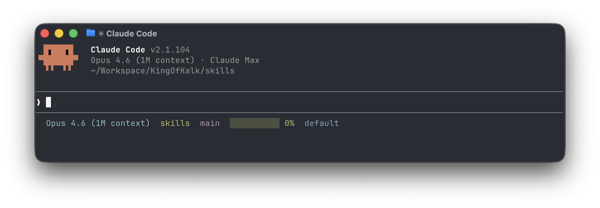

# statusline



A colorful Claude Code statusline that renders on a single line:

- **Model** — current model display name
- **Directory** — basename of the working directory
- **Git branch** — with a red `!` if the tree is dirty or has untracked files
- **Context window** — usage bar plus percentage; green above 50%, yellow above 20%, red below
- **Output style** — active Claude Code output style

## Installation

Install via the KingOfKalk marketplace:

```
/plugin marketplace add KingOfKalk/claude_code_plugins
/plugin install statusline@KingOfKalk:claude_code_plugins
```

Installing the plugin is not enough — Claude Code does not yet pick up `statusLine` from plugin manifests, so you must wire the script into your own `settings.json` to activate it.

Add the following to `~/.claude/settings.json` (or your project's `.claude/settings.json`):

```json
{
  "statusLine": {
    "type": "command",
    "command": "$HOME/.claude/plugins/marketplaces/KingOfKalk:claude_code_plugins/plugins/statusline/statusline.sh",
    "padding": 0,
    "refreshInterval": 5
  }
}
```

Restart Claude Code after editing `settings.json` to see the statusline.

## Requirements

- `bash`
- `jq` on `PATH`
- `git` on `PATH` (used to read branch and dirty state)

## How it works

Claude Code invokes `statusline.sh` on every render, piping a JSON payload to stdin. The script extracts model, cwd, context-window remaining percentage, and output style, then prints a single ANSI-colored line.
